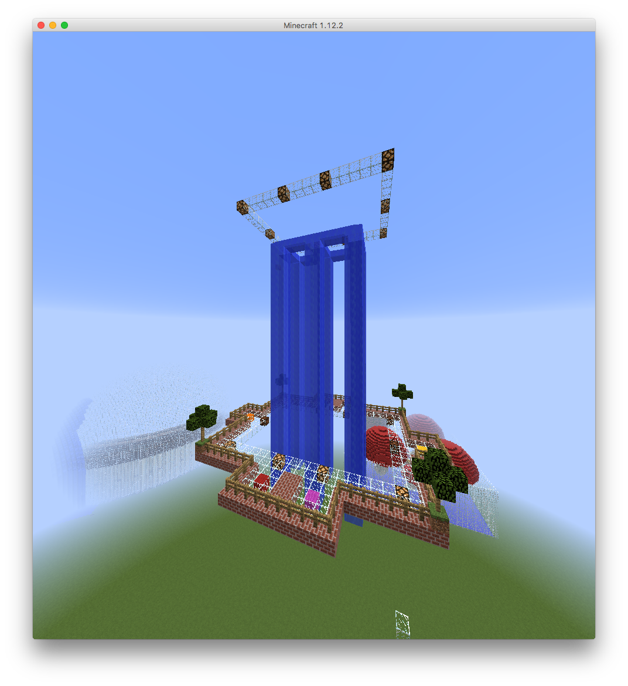
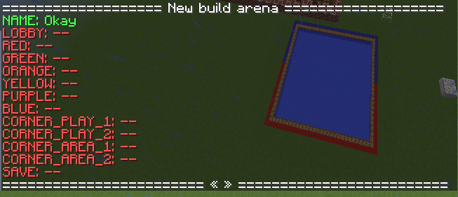

# Game King of The Water

The goal of the minigame is to gather points by pushing players from the water.
The game can be played with 2 to 6 players and they can leave and start when they want.
To join the game players need an empty inventory and can do `/kow join [map name]` if they don't specify the map name they will join the first game.
When they join they will receive a knockback 1 stick and a color to be recognized easy.

Here is a video of some gameplay:
https://youtu.be/wIH0rfleCxo

## Images

## Setup
If you want to use my arena download it [here from github] its in a schematic format.
If you build a area yourself I advise you to use worldedit in `//fast` mode so the water doesn't flow.

To setup the arena
use `/kow admin` and select `Create new` uppon clicking you will get a command that you have to replace `<name>` with the game name like `default`
after running the command you will get a list like this:

You fly to the point where you want to set it and click on the text, it should turn green and say Okay.

After setting all the locations click on `save` the arena should now be added to `/kow list` 

## Permissions

| Command | Permission |
|---------|------------|
| `/kow join` | `gamekow.join` |
| `/kow list` | `gamekow.join` |
| `/kow leave` | `gamekow.leave` |
| `/kow admin` | `gamekow.admin` |

